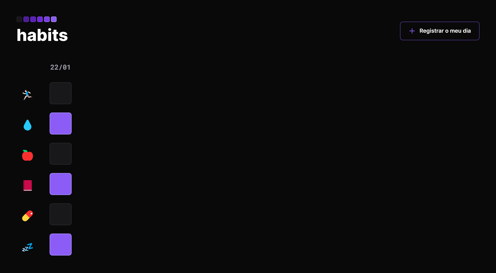

# Habits

  Preview:
    &nbsp;&nbsp;&nbsp;
  <a href="./preview/425x635">425x635</a>
    &nbsp;&nbsp;&nbsp;|&nbsp;&nbsp;&nbsp;
  <a href="./preview/1440x747">1440x747</a>

## Projeto 💻
Projeto desenvolvido durante a NLW Setup da Rocketseat na Trilha Explorer.  
(https://www.figma.com/file/B1G0UJE97GRNqL6RvzYXfV/Habits-(e)-(Community)?t=RLgu8NzsTzvDBpdV-6)

## Instalação 🛠
Siga esses passos para instalar o repositório na sua máquina:
1. Rode `git clone https://github.com/miishiyama/Habits` para fazer um clone desse repositório.
2. Abra o arquivo HTML.

## Tecnologias 🚀
As tecnologias utilizadas neste projeto são:
- HTML
- CSS
- JavaScript
- DOM
- Media Queries
- Google Fonts

## Créditos ❤️
Feito por [Millene Eduarda Ishiyama](https://github.com/miishiyama/).
